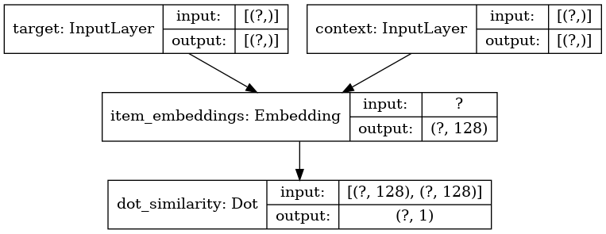

# Phenotype Embedding using graph representation learning
The goal of this project is to learn phenotype representation with vector embedding by applying a graph representation learning algorithm, i.e., [Node2Vec](https://dl.acm.org/doi/abs/10.1145/2939672.2939754), on the Human Phenotype Ontology (HPO) Directed Acyclic Graph (DAG). Here, we present a novel approach to phenotype representation by incorporating phenotypic frequencies based on 53 million full-text health care notes from more than 1.5 million individuals. We demonstrate the efficacy of our proposed phenotype embedding technique by comparing our work to existing phenotypic similarity-measuring methods. Using phenotype frequencies in our embedding technique, we are able to identify phenotypic similarities that surpass current computational models. Furthermore, our embedding technique exhibits a high degree of agreement with domain experts' judgment. By transforming complex and multidimensional phenotypes from the HPO format into vectors, our proposed method enables efficient representation of these phenotypes for downstream tasks that require deep phenotyping. This is demonstrated in a patient similarity analysis and can further be applied to disease trajectory and risk prediction.

The paper is available on [Artificial Intelligence in Medicine](https://www.sciencedirect.com/science/article/pii/S0933365723000374):
- Daniali M, Galer PD, Lewis-Smith D, Parthasarathy S, Kim E, Salvucci DD, Miller JM, Haag S, Helbig I. Enriching representation learning using 53 million patient notes through human phenotype ontology embedding. Artificial intelligence in medicine. 2023 May 1;139:102523.


Given an input graph $G = (V,E)$, where $V$ is a set of vertices (also known as nodes) and $E$ is a set of edges, the Node2Vec algorithm finds an embedding space to map the nodes based on their neighborhood connectivity. In doing so, Node2Vec:

<ol>
<li>Generates biased random walks to find the neighborhood of each node</li>
<li>Finds positive and negative samples to learn the negative sampling objective function</li>
<li>Trains the skip-gram (SG) model to find similar nodes given a node</li>
<li>The learned weights can serve as the embedding vectors</li>
</ol>



We apply a similar model to phenotype embeddings. In order to get a better representation of phenotypes, this repositoy supports a probabilistic edge weighting method for the input graph. In doing so, it determines the frequency of each node (phenotype) in a given corpus, here a database table of patients and their HPO terms, and calculates the cumulative probability of its descendants. Then, an edge $e$ connecting nodes $n_1$ and $n_2$ has a weight equal to $min(p_{n_1}, p_{n_2})$, where $p_{i}$ is the cumulative probability of node $i$. In this method, by default, all edges have a weight equal to the probability difference between the two most common nodes so that all nodes could be accessible in the biased random walks.

You can specify the following set of parameters or follow the default values provided in `configuration.ini` :
- Node2Vec: parameters of the embedding model
- Paths: list of paths for loading modules, HPO files, and saving directory
- DAG properties: properties of the HPO DAG
- Saved_Files: paths and names of the saved files used for loading the model

In case of accidental and unwanted change in `configuration.ini`, Users can call the `reset()` method in the `config.py` module to reset to the default configurations. Code snippet is provided below. See (*).


## Requirements
Install the packages using the provided conda environment yaml files. 
- For devices with a GPU use:
	```bash
	conda env create -f requirements/env_gpu.yml
	```
- For devices with no GPU use:
	```bash
	conda env create -f requirements/env_cpu.yml
	```

## Usage
To get the phenotypes embeddings, run the code below in the project directory. Additional functionalities are available in `scripts/main.py`.

```python
import os
import sys
from pathlib import Path
import networkx as nx
from scripts.config import Config
from scripts.convert_to_nx import NxGraph
from scripts.graph_embedding import Node2Vec
from scripts.dag import build_dag


default_config_path = 'scripts/configuration.ini'
default_config_path = Path(default_config_path).resolve()

# Run the following code block to reset the configuration file (*).
class_config = Config()
class_config.reset()
class_config.__init__(config_path = default_config_path) 

# Load configuration.ini into a dictionary
params = Config(config_path = default_config_path).params

if not os.path.exists(params['save_path']):
	os.makedirs(params['save_path'])
	
# Build dag from HPO
sys.path.append(params['main_dir'])
hpo_dag = build_dag()

# Convert dag to an nx object
nx_object = NxGraph(hpo_dag, directed = False, weight_system = params['weight_system']) 

nx_object.create_graph()
hpo_nx_graph = nx_object.graph
hpo2vec = Node2Vec(hpo_nx_graph)

# Train the embedding model (Node2Vec+ if params['extended'] is True)
hpo2vec.run(params['extended'])
hpo2vec.save_embeddings()
```

### Evaluation
A more detailed evaluation is provided in `main.py` that compares the average cosine similarity of nodes in a subgraph with some randomly selected nodes.

```bash
python scripts/main.py
```

To explore various experiments and combinations of edge weights, as discussed in the paper, we have provided template configuration files. To run an experiment, copy the relevant configuration file from `./scripts/configuration_bk/template_configurations/` into `./phenotype_embedding/scripts/configuration.ini`. Note: Avoid resetting the config file after making changes.

You can visualize the phenotypes in a 2D or 3D space using  TensorBoard Embedding Projector (read more [here](https://www.tensorflow.org/tensorboard/tensorboard_projector_plugin)). You can also use its [online tool](https://projector.tensorflow.org/). The required `embedding.tsv` and `metadata.tsv` files will be stored in `[save_path]/log_dir/[timestamp]` for each experiment run.